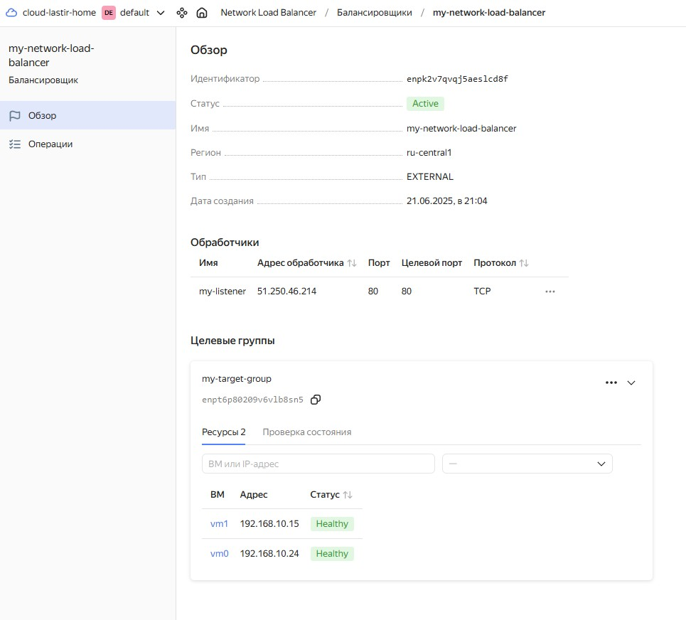
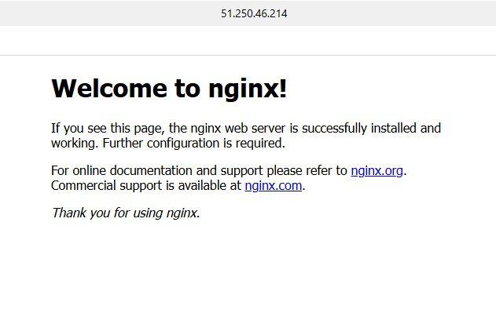
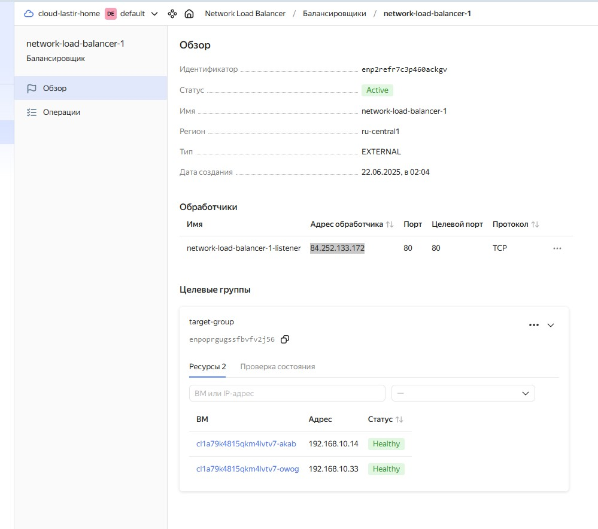
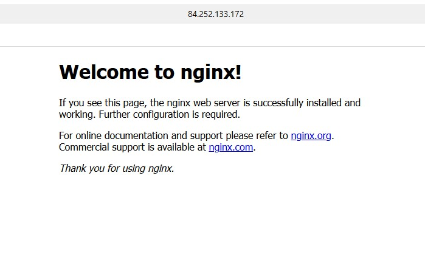

# Домашнее задание к занятию «Отказоустойчивость в облаке» - Минин Александр

 ---

## Задание 1 

Возьмите за основу [решение к заданию 1 из занятия «Подъём инфраструктуры в Яндекс Облаке»](https://github.com/netology-code/sdvps-homeworks/blob/main/7-03.md#задание-1).

1. Теперь вместо одной виртуальной машины сделайте terraform playbook, который:

- создаст 2 идентичные виртуальные машины. Используйте аргумент [count](https://www.terraform.io/docs/language/meta-arguments/count.html) для создания таких ресурсов;
- создаст [таргет-группу](https://registry.terraform.io/providers/yandex-cloud/yandex/latest/docs/resources/lb_target_group). Поместите в неё созданные на шаге 1 виртуальные машины;
- создаст [сетевой балансировщик нагрузки](https://registry.terraform.io/providers/yandex-cloud/yandex/latest/docs/resources/lb_network_load_balancer), который слушает на порту 80, отправляет трафик на порт 80 виртуальных машин и http healthcheck на порт 80 виртуальных машин.

Рекомендуем изучить [документацию сетевого балансировщика нагрузки](https://cloud.yandex.ru/docs/network-load-balancer/quickstart) для того, чтобы было понятно, что вы сделали.

2. Установите на созданные виртуальные машины пакет Nginx любым удобным способом и запустите Nginx веб-сервер на порту 80.

3. Перейдите в веб-консоль Yandex Cloud и убедитесь, что: 

- созданный балансировщик находится в статусе Active,
- обе виртуальные машины в целевой группе находятся в состоянии healthy.

4. Сделайте запрос на 80 порт на внешний IP-адрес балансировщика и убедитесь, что вы получаете ответ в виде дефолтной страницы Nginx.

*В качестве результата пришлите:*

*1. Terraform Playbook.*

*2. Скриншот статуса балансировщика и целевой группы.*

*3. Скриншот страницы, которая открылась при запросе IP-адреса балансировщика.*

## Решение 1
[providers.tf](providers.tf)
```
terraform {
  required_providers {
    yandex = {
      source  = "yandex-cloud/yandex"
    }
  }

  required_version = ">=1.8.4"
}

provider "yandex" {
  # token                    = "do not use!!!"
  zone  = "ru-central1-b"
}
```
[vms.tf](vms.tf)
```

#считываем данные об образе ОС
data "yandex_compute_image" "ubuntu_2204_lts" {
  family = "ubuntu-2204-lts"
}

resource "yandex_compute_instance" "vm" {
  count       = 2
  name        = "vm${count.index}" #Имя ВМ в облачной консоли
  hostname    = "vm${count.index}" #формирует FDQN имя хоста, без hostname будет сгенрировано случаное имя.
  platform_id = "standard-v3"
  zone        = "ru-central1-b" #зона ВМ должна совпадать с зоной subnet!!!

  resources {
    cores         = 2
    memory        = 1
    core_fraction = 20
  }

  boot_disk {
    initialize_params {
      image_id = data.yandex_compute_image.ubuntu_2204_lts.image_id
      type     = "network-hdd"
      size     = 10
    }
  }

  metadata = {
    user-data          = file("./cloud-init.yml")
    serial-port-enable = 1
  }


  network_interface {
    subnet_id          = yandex_vpc_subnet.subnet-1.id
    nat                = true
  }
}

resource "yandex_vpc_network" "network-1" {
  name = "network1"
}

resource "yandex_vpc_subnet" "subnet-1" {
  name           = "subnet1"
  zone           = "ru-central1-b"
  network_id     = yandex_vpc_network.network-1.id
  v4_cidr_blocks = ["192.168.10.0/24"]
}

resource "yandex_lb_target_group" "my_tg" {
  name      = "my-target-group"
 

  dynamic "target" {
    for_each = yandex_compute_instance.vm
    content {
      subnet_id = yandex_vpc_subnet.subnet-1.id
      address   = target.value.network_interface.0.ip_address
    }
  }
}

resource "yandex_lb_network_load_balancer" "my_nlb" {
  name = "my-network-load-balancer"

  listener {
    name = "my-listener"
    port = 80
    external_address_spec {
      ip_version = "ipv4"
    }
  }

  attached_target_group {
    target_group_id = yandex_lb_target_group.my_tg.id

    healthcheck {
      name = "http"
      http_options {
        port = 80
        path = "/"
      }
    }
  }
}


output "vms" {
  value = {
    for name, vm in yandex_compute_instance.vm : vm.name => vm.network_interface.0.nat_ip_address
  }
}


output "nlb" {
  value = {
    for listener in yandex_lb_network_load_balancer.my_nlb.listener : listener.name => [
      for spec in listener.external_address_spec : spec.address
    ]
  }
}


```



---

## Задания со звёздочкой*
Эти задания дополнительные. Выполнять их не обязательно. На зачёт это не повлияет. Вы можете их выполнить, если хотите глубже разобраться в материале.

---

## Задание 2*

1. Теперь вместо создания виртуальных машин создайте [группу виртуальных машин с балансировщиком нагрузки](https://cloud.yandex.ru/docs/compute/operations/instance-groups/create-with-balancer).

2. Nginx нужно будет поставить тоже автоматизированно. Для этого вам нужно будет подложить файл установки Nginx в user-data-ключ [метадаты](https://cloud.yandex.ru/docs/compute/concepts/vm-metadata) виртуальной машины.

- [Пример файла установки Nginx](https://github.com/nar3k/yc-public-tasks/blob/master/terraform/metadata.yaml).
- [Как подставлять файл в метадату виртуальной машины.](https://github.com/nar3k/yc-public-tasks/blob/a6c50a5e1d82f27e6d7f3897972adb872299f14a/terraform/main.tf#L38)

3. Перейдите в веб-консоль Yandex Cloud и убедитесь, что: 

- созданный балансировщик находится в статусе Active,
- обе виртуальные машины в целевой группе находятся в состоянии healthy.

4. Сделайте запрос на 80 порт на внешний IP-адрес балансировщика и убедитесь, что вы получаете ответ в виде дефолтной страницы Nginx.

*В качестве результата пришлите*

*1. Terraform Playbook.*

*2. Скриншот статуса балансировщика и целевой группы.*

*3. Скриншот страницы, которая открылась при запросе IP-адреса балансировщика.*

## Решение 2

[providers.tf](./task2/providers.tf)
```
terraform {
  required_providers {
    yandex = {
      source  = "yandex-cloud/yandex"
    }
  }

  required_version = ">=1.8.4"
}

provider "yandex" {
  # token                    = "do not use!!!"
  zone  = "ru-central1-b"
}
```
[vms.tf](./task2/vms.tf)
```
resource "yandex_compute_instance_group" "ig-1" {
  name                = "fixed-ig-with-balancer"
  service_account_id  = "aje9prmjm8pkpggvaiog"
  deletion_protection = "false"
  instance_template {
    platform_id = "standard-v3"
    resources {
      memory = 1
      cores  = 2
      core_fraction = 20
    }

    boot_disk {
      mode = "READ_WRITE"
      initialize_params {
        image_id = "fd80j21lmqard15ciskf"
      }
    }

    network_interface {
      network_id         = "${yandex_vpc_network.network-1.id}"
      subnet_ids         = ["${yandex_vpc_subnet.subnet-1.id}"]
      nat                = true
    }

    metadata = {
      user-data          = file("./cloud-init.yml")
      serial-port-enable = 1
    }
  }

  scale_policy {
    fixed_scale {
      size = 2
    }
  }

  allocation_policy {
    zones = ["ru-central1-a"]
  }

  deploy_policy {
    max_unavailable = 1
    max_expansion   = 0
  }

  load_balancer {
    target_group_name        = "target-group"
    target_group_description = "Целевая группа Network Load Balancer"
  }
}

resource "yandex_lb_network_load_balancer" "lb-1" {
  name = "network-load-balancer-1"

  listener {
    name = "network-load-balancer-1-listener"
    port = 80
    external_address_spec {
      ip_version = "ipv4"
    }
  }

  attached_target_group {
    target_group_id = yandex_compute_instance_group.ig-1.load_balancer.0.target_group_id

    healthcheck {
      name = "http"
      http_options {
        port = 80
        path = "/"
      }
    }
  }
}

resource "yandex_vpc_network" "network-1" {
  name = "network1"
}

resource "yandex_vpc_subnet" "subnet-1" {
  name           = "subnet1"
  zone           = "ru-central1-a"
  network_id     = "${yandex_vpc_network.network-1.id}"
  v4_cidr_blocks = ["192.168.10.0/24"]
}

```
[cloud-init.yml](./task2/cloud-init.yml)
```yml
#cloud-config
datasource:
  Ec2:
    strict_id: false

users:
  - name: lastir
    groups: sudo
    shell: /bin/bash
    sudo: 'ALL=(ALL) NOPASSWD:ALL'
    ssh_authorized_keys:
      - ssh-ed25519 AAAAC3NzaC1lZDI1NTE5AAAAIJOvLHUow4xL/do0YfCupDO3WTL5t5gy9aD5jMasc5fO lastir@netology

write_files:
  - path: "/usr/local/etc/startup.sh"
    permissions: "755"
    content: |
      #!/bin/bash

      apt-get update
      apt-get install -y nginx
      service nginx start
    defer: true
runcmd:
  - [sudo, "/usr/local/etc/startup.sh"]
```


